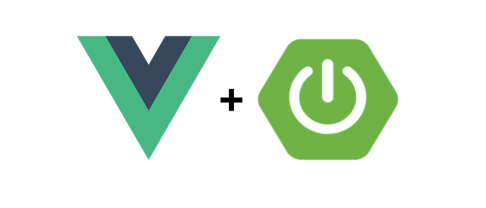

# Onlus Manager
A reusable Springboot app using Vue.js as frontend

[](https://travis-ci.org/prima-s/onlus-manager-test)
[](https://github.com/spring-projects/spring-boot)
[](https://nodejs.org/en/)
[](https://vuejs.org/)
[](https://cli.vuejs.org/)
[](https://webpack.js.org/)
[](https://github.com/axios/axios)
[](https://jestjs.io/)
[](http://nightwatchjs.org/)



A live deployment is available on Heroku: https://onlus-app.herokuapp.com

## Table of Contents  
* [Setup Vue.js & Spring Boot](#setup-vuejs--spring-boot)
* [Project setup](#project-setup)
* [First App run](first-app-run)
* [Faster feedback with webpack-dev-server](#faster-feedback-with-webpack-dev-server)
* [Browser developer tools extension](#browser-developer-tools-extension)
* [Travis Configuration](#travis-configuration)

## Setup Vue.js & Spring Boot

### Prerequisites

#### MacOSX

```
brew install node
npm install -g @vue/cli
```

#### Linux

```
sudo apt update
sudo apt install node
npm install -g @vue/cli
```

#### Windows

```
choco install npm
npm install -g @vue/cli
```

## Project setup

```
spring-boot-vuejs
├─┬ backend     → backend module with Spring Boot code
│ ├── src
│ └── pom.xml
├─┬ frontend    → frontend module with Vue.js code
│ ├── src
│ └── pom.xml
└── pom.xml     → Maven parent pom managing both modules
```

## First App run

Once downloaded the zip file (or cloned it) please change database data in [application-properties-file](backend/src/main/resources/application-properties.txt) application.properties according to yours.
Then from the root directory, do a: 

```
mvn clean install
```

Run our complete Spring Boot App:

```
mvn --projects backend spring-boot:run
```

Now go to http://localhost:8088/ and have a look at your first Vue.js Spring Boot App.


## Faster feedback with webpack-dev-server

The webpack-dev-server, which will update and build every change through all the parts of the JavaScript build-chain, is pre-configured in Vue.js out-of-the-box! So the only thing needed to get fast feedback development-cycle is to cd into `frontend` and run:

```
npm run serve
```

NOTE - You may need to run:

```
npm rebuild node-sass
```

from inside the frontend directory in order to make it properly run with your environment.

That’s it! 


## Browser developer tools extension

Install vue-devtools Browser extension https://github.com/vuejs/vue-devtools and get better feedback, e.g. in Chrome:

## Travis Configuration

Concerning the configuration of Travis Continuous Integration tool give a look at the doc file [travis-doc-file](docs/travisCI-config.txt)
